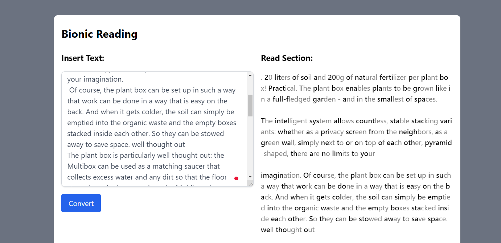
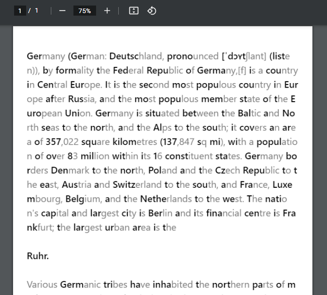

# :notebook: Bionic ReadingTool 
A revolutionary way for guiding the eyes through text using artificial fixation spots to make reading easier. As a result, the reader's attention is drawn solely to the highlighted starting letters, leaving the word to be completed by the brain center. Bionic Reading attempts to foster greater in-depth reading and understanding of textual content in a digital environment dominated by shallow kinds of reading.

vite-react-tailwind-bionic-reading project 


## What is Next? 🌟

| Name                                                                              | Short Description                                          | Status       |
| --------------------------------------------------------------------------------- | ---------------------------------------------------------- | ---------- |
| Save as PDF                                   | Create a button and download as PDF the text |:heavy_check_mark:
| Unicode Support                                   | Insert unicode characters | :heavy_check_mark:
| Show characters                                   | Display Characters after textarea | backlog
| Increase fonts                                   | Create functionality to increase/descrease fonts size | backlog


### How to Run

```
npm i && npm dev
```
or 
```
yarn && yarn dev
```

## PDF functionality



## Contribution

Pull requests are welcome :)

## Preview
Frontend live demo ([click](https://crisanlucid.github.io/vite-react-tailwind-bionic-reading/))


## Stars history

[](https://starchart.cc/crisanlucid/vite-react-tailwind-bionic-reading)

