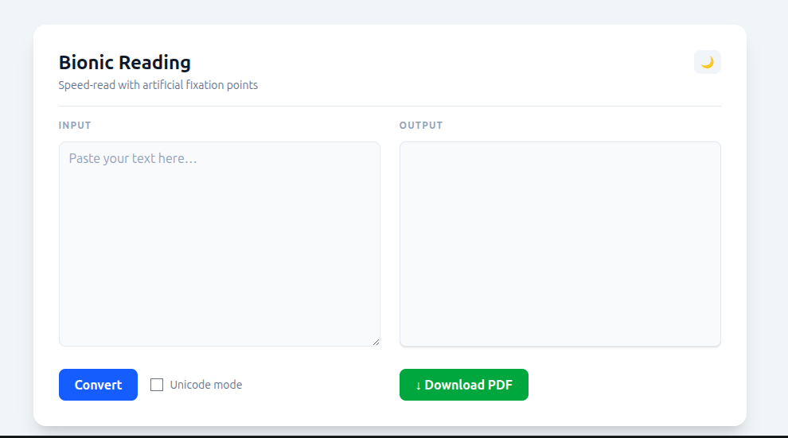
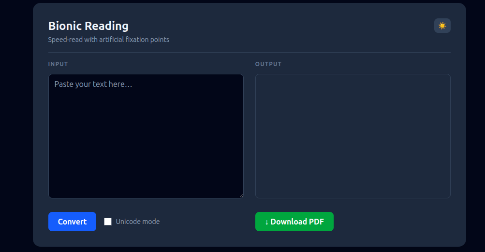

# :notebook: Bionic ReadingTool

[](https://github.com/crisanlucid/vite-react-tailwind-bionic-reading/actions/workflows/nodejs.yml)
[](https://github.com/crisanlucid/vite-react-tailwind-bionic-reading/actions/workflows/codeql-analysis.yml)
[](https://github.com/crisanlucid/vite-react-tailwind-bionic-reading/actions/workflows/deploy.yml)

Open-source **React**, **Vite**, **Tailwind CSS** & **TypeScript** app that converts text with artificial fixation points for faster bionic reading. The brain completes each word from its bold starting letters — increasing reading speed by up to 30%. Supports Unicode mode, PDF export, file import (TXT, DOCX, PDF, EPUB), bionic EPUB export, and light/dark theme.

**[▶ Live Demo](https://crisanlucid.github.io/vite-react-tailwind-bionic-reading/)**

| Light mode | Dark mode |
|:---:|:---:|
|  |  |
## What is Next? 🌟

| Name                                                                              | Short Description                                          | Status       |
| --------------------------------------------------------------------------------- | ---------------------------------------------------------- | ---------- |
| Save as PDF                                   | Create a button and download as PDF the text | :heavy_check_mark:
| Unicode Support                                   | Insert unicode characters | :heavy_check_mark:
| Fix PDF export background                         | Replace html2canvas with html-to-image for Tailwind v4 compatibility — eliminates gray background in exported PDF | :heavy_check_mark:
| Sharp PDF export                                  | Capture at 3× pixel ratio and render at physical size via `calcPdfImageLayout` (px→mm) — eliminates blurry text in exported PDF | :heavy_check_mark:
| Reusable UI components                            | Extract Button, Textarea, Checkbox, ReadOutput into `src/components/` — accessible, typed, and independently testable | :heavy_check_mark:
| Dark mode                                         | Light/dark theme toggle with `localStorage` persistence | :heavy_check_mark:
| File import (TXT, DOCX, PDF, EPUB)               | Import files via advanced mode toggle — parsed client-side, files never leave the browser | :heavy_check_mark:
| Bionic EPUB export                                | Export a bionic-formatted `.epub` file with `<b>` fixation points applied to all HTML chapters | :heavy_check_mark:
| Show characters                                   | Display Characters after textarea | backlog
| Increase fonts                                   | Create functionality to increase/descrease fonts size | backlog


### How to Run

```bash
npm install && npm run dev
```

## PDF functionality


PDF export uses [`html-to-image`](https://github.com/bubkoo/html-to-image) + [`jsPDF`](https://github.com/parallax/jsPDF). The Read Section is captured as a PNG at **3× pixel ratio** for sharp text, then placed on the page at its true physical size using `src/util/pdfLayout.ts` (`calcPdfImageLayout`) which converts CSS pixels to millimetres (1 px = 25.4 / 96 mm) and centres the image horizontally.


## File Import & EPUB Export

Enable **Advanced mode** (✨ button in the header) to reveal the **Import file** button. Supported formats:

| Format | Import | Export as Bionic |
|---|---|---|
| TXT | ✅ | — |
| DOCX | ✅ | — |
| PDF | ✅ | — |
| EPUB | ✅ | ✅ `bionic_*.epub` |

All parsing and export runs **entirely in the browser** — files are never uploaded to a server. PDF and DOCX parsers (`pdfjs-dist`, `mammoth`) and the ZIP engine (`jszip`) are lazy-loaded on demand, so they don't affect the initial page load.

The EPUB export applies bionic fixation points directly to each HTML chapter inside the EPUB, preserving the original structure, images, styles, and metadata.

## Contribution

Pull requests are welcome :)

---

## Release Flow

Step-by-step guide for releasing a new version.

### 1. Develop on a feature branch

```bash
git checkout -b feature/my-feature
# ... make changes ...
git add <files>
git commit -m "feat: my feature"
git push origin feature/my-feature
```

### 2. Open a Pull Request → merge into `main`

Opening a PR triggers:
- **Node.js CI** — installs deps, builds, runs tests
- **CodeQL** — security scan

Merging into `main` additionally triggers:
- **Build and Deploy** — deploys to GitHub Pages (only when source files change)

### 3. Bump the version

Go to **Actions → Bump version → Run workflow** and choose:
- `patch` → bug fixes / small improvements (0.5.0 → 0.5.1)
- `minor` → new features, backwards compatible (0.5.0 → 0.6.0)
- `major` → breaking changes (0.5.0 → 1.0.0)

This workflow will:
- Bump `package.json` + `package-lock.json` version
- Create a git tag (e.g. `v0.6.0`) and push it
- Open a PR named `chore: bump version to vX.X.X`

### 4. Merge the version bump PR

Merge the `chore: bump version to vX.X.X` PR into `main`. This automatically:
- Runs CI (install, build, test)
- Deploys to GitHub Pages
- **Creates a GitHub Release** with auto-generated notes

---

## Stars history

[](https://starchart.cc/crisanlucid/vite-react-tailwind-bionic-reading)

