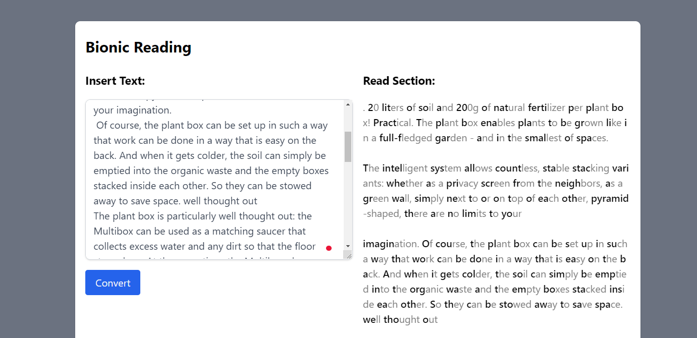

# :notebook: Bionic ReadingTool 
A revolutionary way for guiding the eyes through text using artificial fixation spots to make reading easier. As a result, the reader's attention is drawn solely to the highlighted starting letters, leaving the word to be completed by the brain center. Bionic Reading attempts to foster greater in-depth reading and understanding of textual content in a digital environment dominated by shallow kinds of reading.

vite-react-tailwind-bionic-reading project 


## What is Next? 🌟

| Name                                                                              | Short Description                                          | Status       |
| --------------------------------------------------------------------------------- | ---------------------------------------------------------- | ---------- |
| Save as PDF                                   | Create a button and download as PDF the text |:heavy_check_mark:
| Unicode Support                                   | Insert unicode characters | :heavy_check_mark:
| Show characters                                   | Display Characters after textarea | backlog
| Increase fonts                                   | Create functionality to increase/descrease fonts size | backlog


### How to Run

```
npm i && npm dev
```
or 
```
yarn && yarn dev
```

## PDF functionality


## Contribution

Pull requests are welcome :)

## Preview
Frontend live demo ([click](https://crisanlucid.github.io/vite-react-tailwind-bionic-reading/))

---

## Release Flow

Step-by-step guide for releasing a new version.

### 1. Develop on a feature branch

```bash
git checkout -b feature/my-feature
# ... make changes ...
git add <files>
git commit -m "feat: my feature"
git push origin feature/my-feature
```

### 2. Open a Pull Request → merge into `main`

- Open a PR on GitHub targeting `main`
- Merging triggers automatically:
  - **Node.js CI** — installs deps + builds
  - **Build and Deploy** — deploys to GitHub Pages

### 3. Bump the version

Go to **Actions → Bump version → Run workflow** and choose:
- `patch` → bug fixes / small improvements (0.4.0 → 0.4.1)
- `minor` → new features, backwards compatible (0.4.0 → 0.5.0)
- `major` → breaking changes (0.4.0 → 1.0.0)

This workflow will:
- Bump `package.json` version
- Create and push a git tag (e.g. `v0.4.1`)
- Open a PR to merge the version bump back into `main`

### 4. Merge the version bump PR

A PR named `chore: bump version to vX.X.X` will be opened automatically — merge it into `main`.

### 5. Trigger the release manually

Because `main` is protected, the tag push won't auto-trigger the release workflow.

Go to **Actions → Create Release → Run workflow**.

This will:
- Build the project
- Publish to npm
- Create a GitHub Release with auto-generated notes

---

## Stars history

[](https://starchart.cc/crisanlucid/vite-react-tailwind-bionic-reading)

