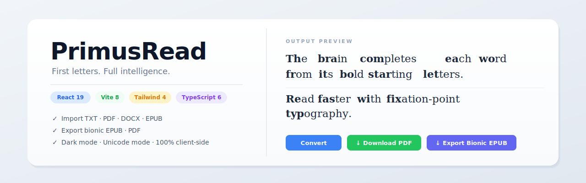
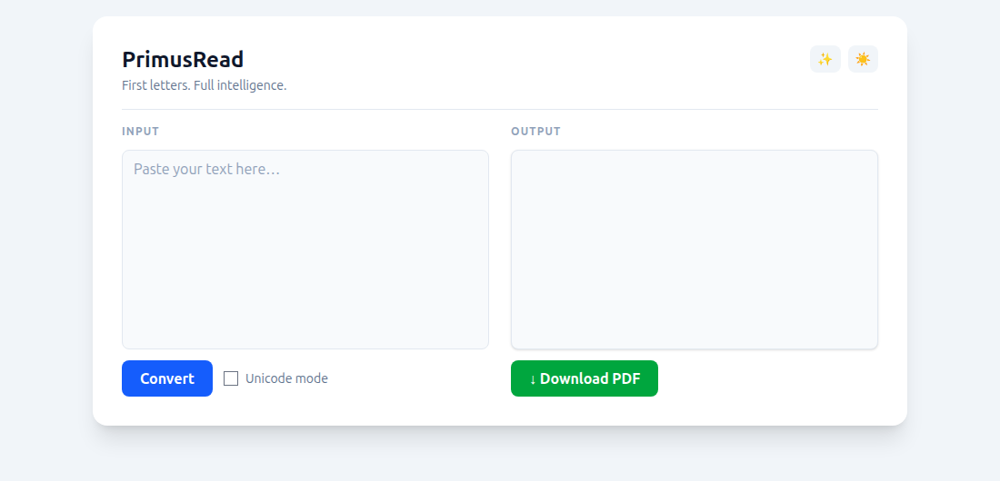
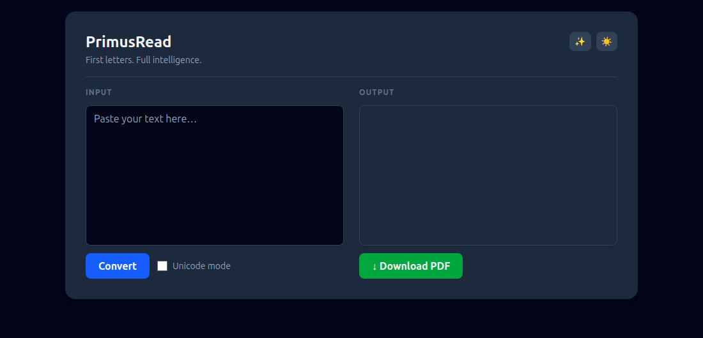
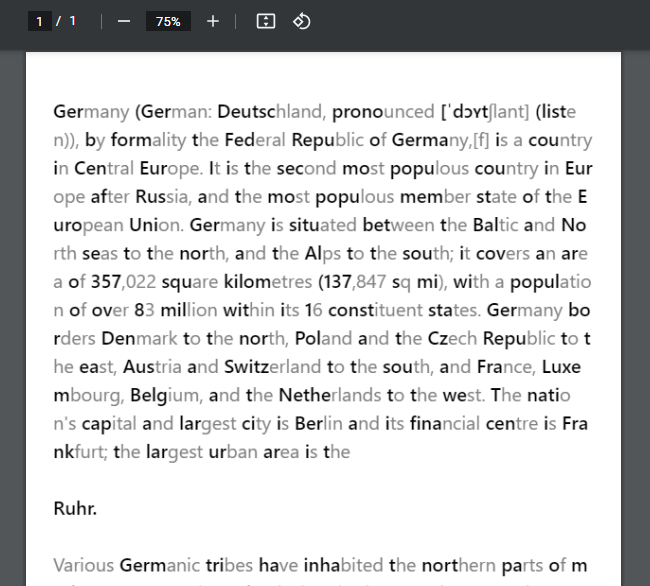

<p align="center">
  
</p>

# PrimusRead

> *First letters. Full intelligence.*

[](https://github.com/crisanlucid/primusread/actions/workflows/nodejs.yml)
[](https://github.com/crisanlucid/primusread/actions/workflows/codeql-analysis.yml)
[](https://github.com/crisanlucid/primusread/actions/workflows/deploy.yml)

Open-source **React**, **Vite**, **Tailwind CSS** & **TypeScript** tool that accelerates document comprehension through AI-driven fixation-point typography. The brain completes each word from its bold starting letters — reducing reading time by up to 30% without loss of retention. Supports Unicode mode, PDF export, file import (TXT, DOCX, PDF, EPUB), bionic EPUB export, and light/dark theme.

**[▶ Live Demo](https://crisanlucid.github.io/primusread/)**

| Light mode | Dark mode |
|:---:|:---:|
|  |  |
## What is Next? 🌟

| Name                                                                              | Short Description                                          | Status       |
| --------------------------------------------------------------------------------- | ---------------------------------------------------------- | ---------- |
| Save as PDF                                   | Create a button and download as PDF the text | :heavy_check_mark:
| Unicode Support                                   | Insert unicode characters | :heavy_check_mark:
| Fix PDF export background                         | Replace html2canvas with html-to-image for Tailwind v4 compatibility — eliminates gray background in exported PDF | :heavy_check_mark:
| Sharp PDF export                                  | Capture at 3× pixel ratio and render at physical size via `calcPdfImageLayout` (px→mm) — eliminates blurry text in exported PDF | :heavy_check_mark:
| Reusable UI components                            | Extract Button, Textarea, Checkbox, ReadOutput into `src/components/` — accessible, typed, and independently testable | :heavy_check_mark:
| Dark mode                                         | Light/dark theme toggle with `localStorage` persistence | :heavy_check_mark:
| File import (TXT, DOCX, PDF, EPUB)               | Import files via advanced mode toggle — parsed client-side, files never leave the browser | :heavy_check_mark:
| Bionic EPUB export                                | Export a bionic-formatted `.epub` file with `<b>` fixation points applied to all HTML chapters | :heavy_check_mark:
| [57× Unicode speedup][perf-commit]                | Hoist `toUnicodeVariant` constants to module scope — data structures built once at load time instead of once per word | :heavy_check_mark:
| Show characters                                   | Display Characters after textarea | backlog
| Increase fonts                                   | Create functionality to increase/descrease fonts size | backlog

[perf-commit]: https://github.com/crisanlucid/primusread/commit/1bd266d8f973ce9d83bfb016e0e1405f48ccf197


### How to Run

```bash
npm install && npm run dev
```

## Performance

Unicode mode (`toUnicodeVariant`) was originally rebuilding all data structures on every call. [Hoisting constants to module scope][perf-commit] reduced the per-call overhead to zero, yielding a **57× throughput improvement** on a 500-word document (86 ops/s → 4,915 ops/s).

| Mode | 500-word document |
|---|---|
| CSS mode (default) | ~15,700 ops/s |
| Unicode mode (after fix) | ~4,900 ops/s |

Run the benchmark yourself: `npm run bench`

## PDF functionality


PDF export uses [`html-to-image`](https://github.com/bubkoo/html-to-image) + [`jsPDF`](https://github.com/parallax/jsPDF). The Read Section is captured as a PNG at **3× pixel ratio** for sharp text, then placed on the page at its true physical size using `src/util/pdfLayout.ts` (`calcPdfImageLayout`) which converts CSS pixels to millimetres (1 px = 25.4 / 96 mm) and centres the image horizontally.


## File Import & EPUB Export

Enable **Advanced mode** (✨ button in the header) to reveal the **Import file** button. Supported formats:

| Format | Import | Export as Bionic |
|---|---|---|
| TXT | ✅ | — |
| DOCX | ✅ | — |
| PDF | ✅ | — |
| EPUB | ✅ | ✅ `bionic_*.epub` |

All parsing and export runs **entirely in the browser** — files are never uploaded to a server. PDF and DOCX parsers (`pdfjs-dist`, `mammoth`) and the ZIP engine (`jszip`) are lazy-loaded on demand, so they don't affect the initial page load.

The EPUB export applies bionic fixation points directly to each HTML chapter inside the EPUB, preserving the original structure, images, styles, and metadata.

## Contribution

Pull requests are welcome :)

---

For the step-by-step release process see [ReleaseFlow.md](./ReleaseFlow.md).

---

## Stars history

[](https://starchart.cc/crisanlucid/primusread)

